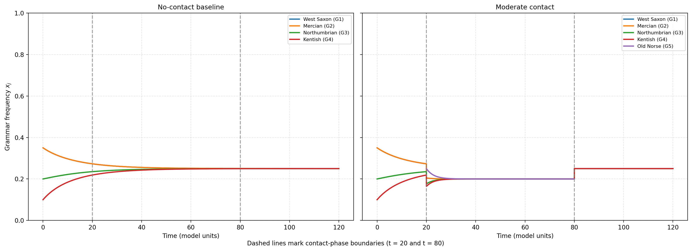

# Grammar Competition and Contact-Induced Instability in the Old-to-Middle English Transition

*Carlos Manuel Orrego Franco — Universidad Nacional de Colombia, 2026*

Simulation code for a computational case study applying Mitchener's (2003) fully symmetric language dynamical equation to the Old English → Middle English transition. Four Old English dialect components compete under replicator–mutator dynamics across three historical phases: pre-contact stability, a Scandinavian contact period with reduced learning fidelity, and post-contact consolidation. The scenarios are exploratory; the model is Mitchener's, not new.



*Left: four Old English dialects under constant high learning fidelity (no contact). Right: same system with Old Norse introduced during the contact phase. Both converge to the same near-uniform final state — contact produces a transient detour, not a shift in the long-run attractor.*

---

## Reproduce the figures

```bash
pip install -r requirements.txt
python3 simulation.py
```

Writes seven PNG figures to `figures/` and prints diagnostics and displacement integrals to stdout. The parameter sweep (Fig. 7) takes ~30–60 s.

---

## Scenarios

`q₁ / q₂ / q₃` = learning fidelity in pre-contact / contact / post-contact phases.
`a` = average cross-grammar intelligibility. `ON` = Old Norse fraction at contact onset.

| Scenario | q₁ | q₂ | q₃ | a | ON |
|---|---:|---:|---:|---:|---:|
| Conservative contact | 0.90 | 0.75 | 0.85 | 0.80 | 0.15 |
| Moderate contact     | 0.90 | 0.65 | 0.80 | 0.80 | 0.25 |
| Strong contact       | 0.90 | 0.55 | 0.75 | 0.75 | 0.33 |
| Canonical (*a* = 0.5)| 0.90 | 0.60 | 0.80 | 0.50 | 0.33 |
| No contact (baseline)| 0.90 |  —   | 0.90 | 0.80 | 0.00 |

Initial OE weights (West Saxon / Mercian / Northumbrian / Kentish): 0.35 / 0.35 / 0.20 / 0.10 in all scenarios except strong contact (0.30 / 0.35 / 0.20 / 0.15). The no-contact baseline integrates strictly with *n* = 4 grammars throughout.

---

## Cite

> Mitchener, W. G. (2003). Bifurcation analysis of the fully symmetric language dynamical equation. *Journal of Mathematical Biology*, 46, 265–285. [doi:10.1007/s00285-002-0172-8](https://doi.org/10.1007/s00285-002-0172-8)

---

MIT © 2026 Carlos Manuel Orrego Franco
